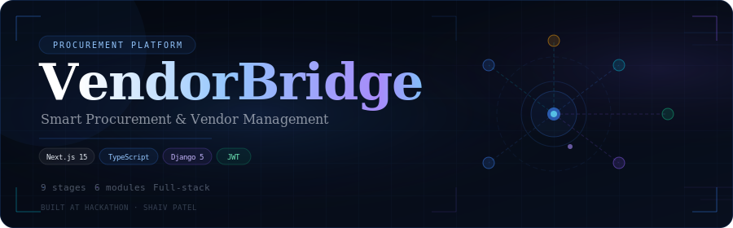

<div align="center">

<!-- BANNER — host banner.svg in your repo at /assets/banner.svg -->


<br/>

[](https://Shaiv05.github.io/vendorbridge)
&nbsp;
[](https://nextjs.org)
[](https://typescriptlang.org)
[](https://djangoproject.com)
[](https://tailwindcss.com)

<br/>

> **Smart Procurement & Vendor Management Platform**  
> *Streamlining the complete procurement lifecycle — from Vendor Onboarding to Purchase Orders*

<br/>

</div>

---

## ✦ Overview

**VendorBridge** is a modern procurement management platform designed to digitize and automate the entire procurement workflow. Built during a hackathon, it enables organizations to manage vendors, create RFQs, collect and compare quotations, rank suppliers, and manage the full procurement cycle from a single interface.

| | |
|---|---|
| **Frontend** | Next.js 15 · TypeScript · Tailwind CSS · Framer Motion |
| **Backend** | Django 5 · Django REST Framework · JWT Auth |
| **Database** | SQLite |
| **Forms & Validation** | React Hook Form · Zod |

---

## ⚡ Problem Statement

Traditional procurement processes suffer from:

- 📋 **Manual vendor tracking** — no single source of truth
- 📧 **Email-based RFQ management** — no audit trail
- 🔢 **Difficult quotation comparison** — no structured evaluation
- 🏝️ **Data silos** — scattered across teams and tools
- ⏳ **Slow approval processes** — no workflow automation

VendorBridge addresses all of these with a unified procurement platform.

---

## 🔄 System Workflow

```
  Vendor Registration
        ↓
  Vendor Management
        ↓
   RFQ Creation
        ↓
 Quotation Submission
        ↓
 Quotation Comparison
        ↓
  Vendor Selection
        ↓
 Approval Workflow
        ↓
  Purchase Order
        ↓
 Invoice Processing
```

---

## 🌟 Key Features

<details>
<summary><b>🔐 Authentication & Security</b></summary>
<br/>

- JWT Authentication
- Secure Login & Registration
- Role-Based Access Control (RBAC)
- Protected Routes
- Session Management

</details>

<details>
<summary><b>🏢 Vendor Management</b></summary>
<br/>

- Vendor Directory with rich profiles
- Category & Contact Management
- Search & Filtering
- Vendor status tracking

</details>

<details>
<summary><b>📋 RFQ Management</b></summary>
<br/>

- Create & manage RFQs
- Assign RFQs to specific vendors
- RFQ tracking & status updates
- Deadline monitoring

</details>

<details>
<summary><b>💰 Quotation Management</b></summary>
<br/>

- Structured quotation submission portal
- Vendor participation tracking
- Bid management
- Status management

</details>

<details>
<summary><b>📊 Comparison Engine</b></summary>
<br/>

- Smart vendor ranking algorithm
- Side-by-side price comparison
- Delivery timeline comparison
- Decision support scoring

</details>

<details>
<summary><b>📈 Dashboard & Analytics</b></summary>
<br/>

- Procurement insights & metrics
- Vendor statistics
- RFQ analytics
- Live procurement tracking

</details>

---

## 🛠 Tech Stack

### Frontend

| Tool | Version | Purpose |
|------|---------|---------|
| [Next.js](https://nextjs.org) | 15 | React framework with SSR/SSG |
| [TypeScript](https://typescriptlang.org) | 5 | Type safety |
| [Tailwind CSS](https://tailwindcss.com) | 3 | Utility-first styling |
| [Framer Motion](https://framer.com/motion) | latest | Animations |
| [React Hook Form](https://react-hook-form.com) | latest | Form management |
| [Zod](https://zod.dev) | latest | Schema validation |
| [Axios](https://axios-http.com) | latest | HTTP client |

### Backend

| Tool | Version | Purpose |
|------|---------|---------|
| [Django](https://djangoproject.com) | 5 | Web framework |
| [Django REST Framework](https://django-rest-framework.org) | latest | API layer |
| [SimpleJWT](https://django-rest-framework-simplejwt.readthedocs.io) | latest | JWT authentication |
| [django-cors-headers](https://github.com/adamchainz/django-cors-headers) | latest | CORS handling |
| SQLite | — | Database |

---

## 📂 Project Structure

```
vendorbridge/
│
├── backend/
│   ├── accounts/        # User auth & JWT
│   ├── core/            # Vendors, RFQs, Quotations
│   ├── vendorbridge/    # Django settings & URLs
│   └── manage.py
│
├── frontend/
│   └── src/
│       ├── app/         # Next.js app router pages
│       ├── components/  # UI components
│       ├── services/    # API layer (Axios)
│       ├── features/    # Feature modules
│       └── types/       # TypeScript interfaces
│
├── assets/
│   └── banner.svg       # README banner
│
└── README.md
```

---

## 🚀 Getting Started

### Prerequisites

- Python 3.10+
- Node.js 18+
- npm or yarn

### Backend Setup

```bash
cd backend

# Create & activate virtual environment
python3 -m venv venv
source venv/bin/activate        # Windows: venv\Scripts\activate

# Install dependencies
pip install -r requirements.txt

# Run migrations & start server
python manage.py migrate
python manage.py runserver
```

> API running at **http://localhost:8000**

### Frontend Setup

```bash
cd frontend

# Install dependencies
npm install

# Configure environment
cp .env.example .env.local
# Set NEXT_PUBLIC_API_URL=http://localhost:8000

# Start dev server
npm run dev
```

> App running at **http://localhost:3000**

---

## 🎨 UI Highlights

- ⚡ Premium Enterprise Dashboard
- 🎞️ Smooth page transitions via Framer Motion
- 📱 Fully responsive, mobile-friendly layout
- 🗂️ Interactive data tables with sorting & filtering
- 🌙 Modern dark-mode procurement interface

---

## 🔮 Roadmap

- [ ] Approval Workflow engine
- [ ] Purchase Order generation
- [ ] Invoice Management
- [ ] PDF export for POs & quotations
- [ ] Email notifications
- [ ] AI-powered vendor recommendations
- [ ] Advanced procurement analytics
- [ ] Vendor performance scoring

---

## 🖥️ Interactive README

> **Want the full animated experience?**  
> This repository includes a fully animated, interactive HTML version of this README.  
> 👉 [**View it live on GitHub Pages →**](https://YOUR_GITHUB_USERNAME.github.io/vendorbridge)

To enable GitHub Pages:
1. Go to **Settings → Pages**
2. Set source to `main` branch, `/docs` folder (or root)
3. Move `README.html` to the configured folder and push

---

## 👨‍💻 Developer

<div align="center">

**Shaiv Patel**  
*Computer Engineering Student*

Built as part of a **Procurement & Vendor Management Hackathon**

</div>

---

<div align="center">

Built with &nbsp;**Next.js** &nbsp;+&nbsp; **Django REST** &nbsp;+&nbsp; **TypeScript**

⭐ **Star this repository** if you found it useful!

</div>
